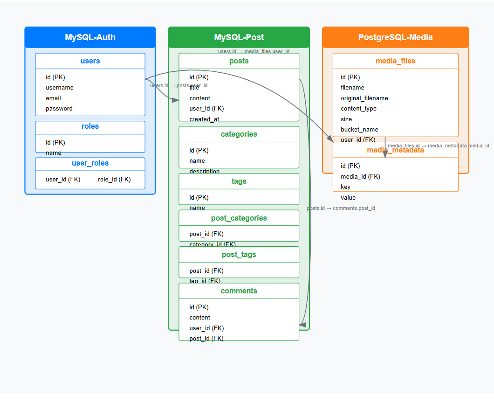

# Blog Application

Blog Application là một hệ thống blog hiện đại được xây dựng trên kiến trúc microservices. Dự án này sử dụng Spring Boot, Spring Cloud, Docker và nhiều công nghệ khác để tạo nền tảng blog mạnh mẽ, dễ mở rộng và bảo mật.

## Tổng quan hệ thống


## Kiến trúc cơ sở dữ liệu



## Sở đồ luồng làm việc


## Demo

### Tương tác với API


## Cấu trúc dự án

Dự án được chia thành các microservice riêng biệt:

- **blog-eureka**: Service Discovery Server sử dụng Netflix Eureka
- **blog-auth**: Dịch vụ xác thực và phân quyền người dùng
- **blog-post**: Dịch vụ quản lý bài viết, danh mục, thẻ và bình luận
- **blog-media**: Dịch vụ quản lý tệp media (hình ảnh, video, v.v.)
- **blog-common**: Thư viện chung được sử dụng bởi tất cả các service

## Cách nhanh nhất để chạy ứng dụng

### Sử dụng script tự động

Dự án cung cấp script để tự động hóa quá trình khởi động:

#### Cho Linux/macOS:
```bash
# Cấp quyền thực thi
chmod +x start-docker.sh

# Chạy script
./start-docker.sh
```

#### Cho Windows:
```powershell
# Chạy script PowerShell
.\start-docker.ps1
```

### Các tính năng của script

1. Khởi động tất cả dịch vụ theo thứ tự tối ưu
2. Dừng hoặc khởi động lại dịch vụ
3. Xem trạng thái và logs của từng dịch vụ
4. Khởi động từng dịch vụ riêng lẻ
5. Rebuild và khởi động lại toàn bộ hệ thống

## Truy cập các dịch vụ

- Eureka Dashboard: http://localhost:8761
- Auth Service API: http://localhost:8081/api/auth
- Post Service API: http://localhost:8082/api
- Media Service API: http://localhost:8083/api/media
- MinIO Console: http://localhost:9001 (đăng nhập: minioAdmin/Minio@Secure123!)

Swagger UI có sẵn cho mỗi dịch vụ:
- Auth Service: http://localhost:8081/api/auth/swagger-ui.html
- Post Service: http://localhost:8082/api/swagger-ui.html
- Media Service: http://localhost:8083/api/media/swagger-ui.html

## Hướng dẫn chi tiết

Xem thêm hướng dẫn chi tiết về cài đặt Docker trong [DOCKER-README.md](DOCKER-README.md).


