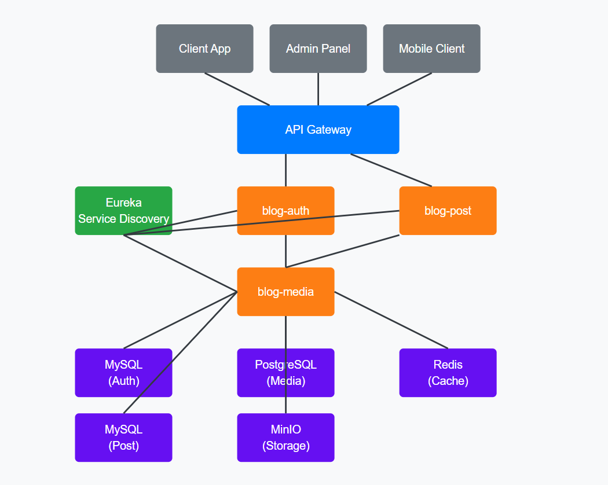
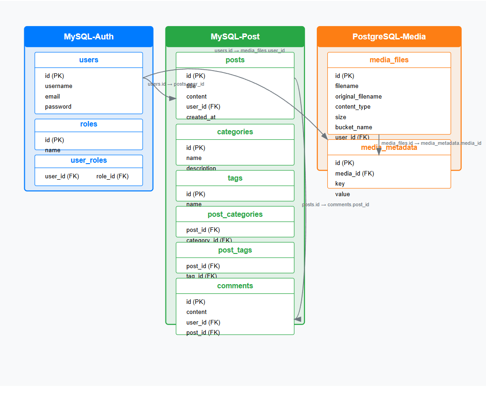
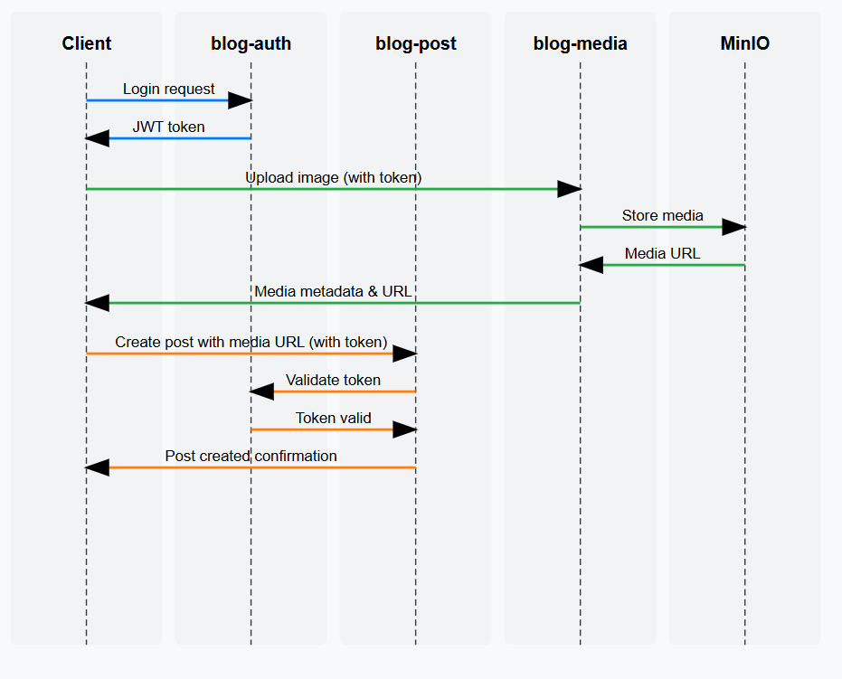
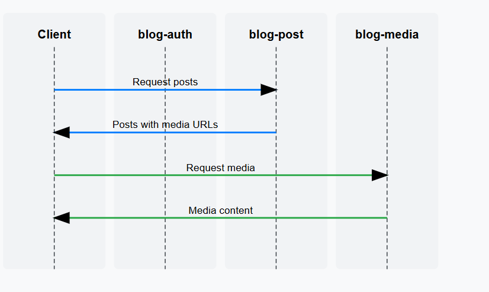

# Blog Application

Blog Application is a modern blog system built on a microservices architecture. This project uses Spring Boot, Spring Cloud, Docker, and many other technologies to create a powerful, scalable, and secure blogging platform.

## System Overview



## Database Architecture



## Workflow Diagrams




## Demo

### API Interaction


## Project Structure

The project is divided into separate microservices:

- **blog-eureka**: Service Discovery Server using Netflix Eureka
- **blog-auth**: Authentication and user authorization service
- **blog-post**: Service for managing posts, categories, tags, and comments
- **blog-media**: Service for managing media files (images, videos, etc.)
- **blog-common**: Common library used by all services

## Quickest Way to Run the Application

### Using Automated Scripts

The project provides scripts to automate the startup process:

#### For Linux/macOS:
```bash
# Grant execute permission
chmod +x start-docker.sh

# Run the script
./start-docker.sh
```

#### For Windows:
```powershell
# Run the PowerShell script
.\start-docker.ps1
```

### Script Features

1. Start all services in the optimal order
2. Stop or restart services
3. View status and logs of each service
4. Start individual services separately
5. Rebuild and restart the entire system

## Accessing Services

- Eureka Dashboard: http://localhost:8761
- Auth Service API: http://localhost:8081/api/auth
- Post Service API: http://localhost:8082/api
- Media Service API: http://localhost:8083/api/media
- MinIO Console: http://localhost:9001 (login: minioAdmin/Minio@Secure123!)

Swagger UI is available for each service:
- Auth Service: http://localhost:8081/api/auth/swagger-ui.html
- Post Service: http://localhost:8082/api/swagger-ui.html
- Media Service: http://localhost:8083/api/media/swagger-ui.html

## Detailed Instructions

See more detailed instructions about Docker installation in [DOCKER-README.md](DOCKER-README.md).
